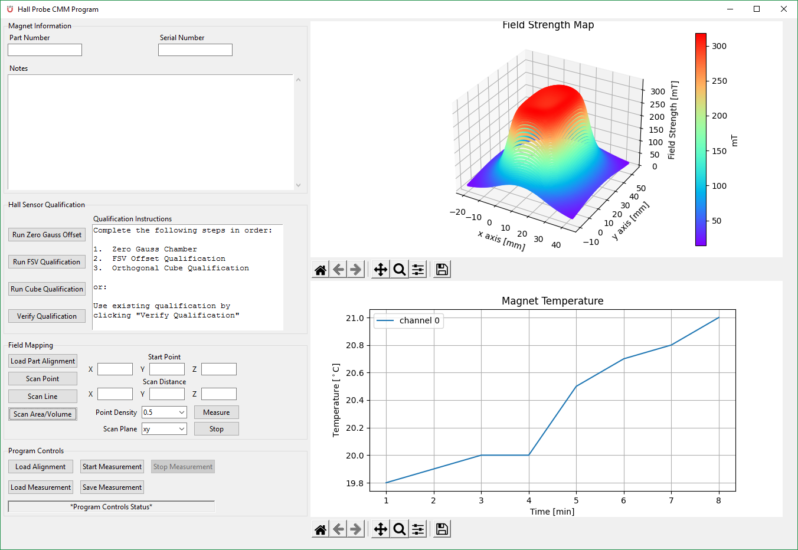
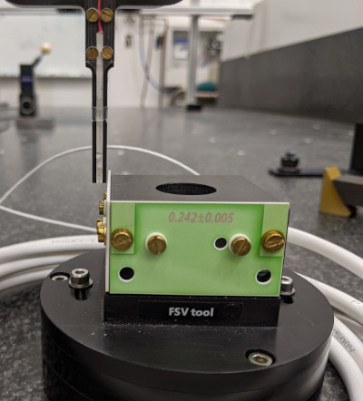

# Hall Probe / CMM Integration

## Intro

This project is designed to integrate a Senis 3-axis hall sensor with a Zeiss Accura CMM.
Instead of using a start-and-stop method of mapping a magnetic field, this system will map on-the-fly along a given path.  The advantages to this method is a major time savings for large mapping areas while only sacrificing a relatively small amount of positional accuracy.

## Equipment and Hardware

### **Zeiss Accura CMM**
The CMM used here is a Zeiss Accura model with a VAST Gold measurement sensor.  The controller box is C99.  The commands python sends to the controller are relatively basic compared to its native communication with Calypso, however, it tends to do the job nicely.  
This setup will work with other Zeiss CMMs so long as a C99 controller box is used, which is most likely the case unless it is a very old machine.  The CMM used here is about 15 years old.

### **National Instruments cDAQ**
* cDAQ-9185 CompactDAQ Chassis, 4-slot
* NI-9212 C Series Temperature Input Module
* NI-9229 C Series Voltage Input Module
* NI-9263 C Series Voltage Output Module

The two main modules of the NI cDAQ are the voltage input and output.
The voltage input module is used to read the ± 12 V analog signal and convert it to digital values.  It also reads the on-board temperature sensor of the hall probe.  
The voltage output module sends a 1.3 V signal to turn on the electronic control box and 5 V signals to turn on the current for the FSV tool and select the sensitivity range of the hall sensor.

### **Senis Electronic Control Box**
This electronic control box performs the following tasks:

* Takes in the signals generated from the hall sensor and outputs a ± 12 V analog signal.
* Supplies current to the FSV tool.
* Takes input in the form of 5 V to switch on/off the box itself, current for the FSV tool, and select sensitivity range of the hall sensor.

### **Field Sensitive Volume (FSV) Tool**

The FSV tool is used to determine the x, y, and z spatial offset relative to the master probe.  Since all travel commands sent to the CMM are with respect to the master probe, those coordinates need to take the different position of the hallprobe into consideration.  A Calypso CMM program is used to establish a local coordinate system of the FSV tool.  The FSV tool does not need to be aligned with the machine coordinate system (MCS) for qualification to take place.  A Calypso PCM script is used to generate rotation and translation values between the local part coordinate system (PCS) and the MCS.

### **Orthogonal Cube**

The orthogonal cube helps correct any non-orthogonality due to sensor placement within the ceramic probe.  This, alongside an additional Calypso program helps establish rotational correction with respect to the MCS.

## Software

The entire project is written in Python.  So far this is still a work in progress and code may break or change in the meantime.  GUI started out as an empty proof of concept and is slowly being modified to contain actual functionality.  Currently only the probe qualification routines are integrated and working within the graphical interface.

### Prerequisites

National Instruments NI-DAQmx drivers must be installed.
Device names in the python scripts are static and must be renamed in NI MAX to the following:
* cDAQ-9185 "MagnetcDAQ"
* NI-9212 "MagnetTemp"
* NI-9229 "FieldSensor"
* NI-9263 "AnalogOut"

Third party python libraries utilized are:
* numpy
* matplotlib
* Pillow
* nidaqmx

All libraries are installable via pip.  For example:

>`pip install nidaqmx`